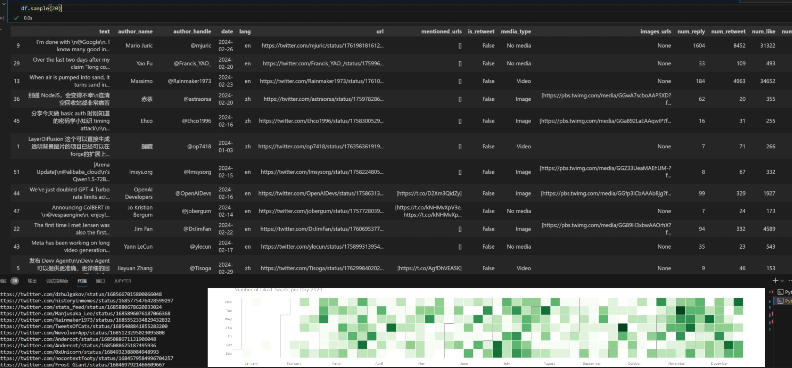
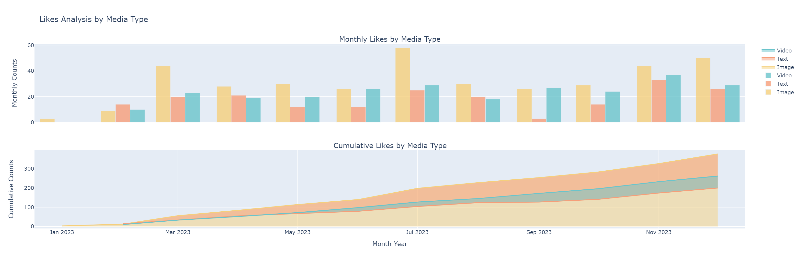
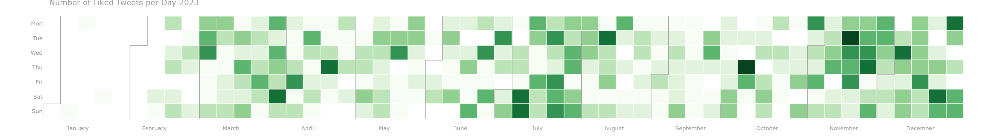

# Twitter-Insight💡

[Readme in English](README.md)

这个项目允许你从 Twitter 获取点赞数据 (基于Selenium)，将其保存为 JSON 和 Excel 文件，并提供一些初步的数据分析和data visualization和图片标注.

这是个人项目的初始阶段，会有更多跟大型语言模型相关的部分.

之后会有更多更新！


## 导出的 Excel 表格和可视化示例：



## Demo Video

[Demo](https://www.youtube.com/watch?v=UA35W-aWQZk)

## 运行准备

在运行代码之前，请确保你具备以下条件：

- 所需的 Python 库（在 `requirements.txt` 中列出）
- Twitter Auth Token (不是API key, 我们不需要那个)
  - 不到一分钟的简单步骤:
    - 浏览器到你已经登陆的twitter.com
    - 按F12 (打开dev tools) -> 点击Application -> Cookies -> Twitter.com -> auth_key
  - FAQs部分有视频流程.

* OpenAI的API Key(可选项,只有图像描述功能会用到)


## Setup

1. 克隆这个仓库或者下载项目文件
2. 命令行里跑一下,把需要的Python库都装上:

```
pip install -r requirements.txt
```

3. 打开 `config.py`,把你的API Key填进去:

* 把 `TWITTER_AUTH_TOKEN`设置成你的Twitter Auth Key
* 把 `OPENAI_API_KEY`设置成你的OpenAI API Key

## 数据抓取

要从 Twitter 获取数据并将其保存为 JSON 和 Excel 文件，请按照以下步骤操作：

1. 打开 `twitter_data_ingestion.py` 文件。
2. 在最底下找到 `fetch_tweets`这个函数,改一下里面的参数:

- 设置你要获取数据的 Twitter 页面的 URL（例如，`https://twitter.com/ilyasut/likes`）。
- 指定数据范围的开始和结束日期（格式为 YYYY-MM-DD, 比如2023-09-21）。

3. 通过执行以下命令运行脚本 (更推荐在IDE里直接跑)：

```
python twitter_data_ingestion.py
```

4. 该脚本将从 Twitter 获取数据，将其保存到 JSON 文件中，然后将其导出到 Excel 文件中。

## 数据分析

要对获取的数据进行初步分析，请按照以下步骤操作：

1. 在 Jupyter Notebook 或 JupyterLab 中打开 `twitter_data_initial_exploration.ipynb` 笔记本。
2. 按顺序运行笔记本单元格，从 JSON 文件加载数据并执行各种数据分析任务。

一些示例结果：

- 点赞帖子类型可视化
  
- Github风格的每日点赞推文的日历热图
  

3. 用 OpenAI API 为推文图片生成描述(带推文元数据)
   

## 示例输出

该项目包括供参考的示例输出文件：

- `sample_output_json.json`：包含获取的 Twitter 数据的示例 JSON 文件。
- `sample_exported_excel.xlsx`：从 JSON 数据导出的示例 Excel 文件。

随意探索和修改代码,让它更适合你的数据分析需求吧!

## FAQs:

- 会被ban么? 会影响账号吗?

  - Selenium已经是最安全的抓取方式之一了, 但自用还是注意.
  - 我自己使用了挺长时间一直没事.
  - (不过如果有小号, 还是建议用小号的auth token来)
- 怎么找auth token啊!

  - 可以看这个
    - [视频 demo](https://www.youtube.com/watch?v=MhKMNsbjug4)

## 贡献

欢迎贡献代码!如果你发现了bug或者有改进建议,请提交issue或者pull request

    

## 致谢

- 项目的初始结构和部分Selenium代码参考了 [Twitter-Scrapper](https://github.com/Mostafa-Ehab/Twitter-Scrapper)。
- 图像标题功能由 OpenAI API 提供支持。你应该能够使用 Gemini 1.0 实现类似的结果。

如有任何问题或疑问，请在issue中提出问题。
